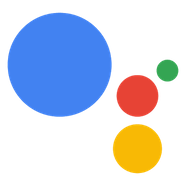

# MMM-GoogleAssistant

Google Assistant module for your Magic Mirror.

You can now ask questions to your MagicMirror powered by Google Assistant.

All this module does for now is show the following logo -

And animates it to following when assistant is activated using the hotword 'Ok Google' -

It also shows up parsed user speech that is sent to Google Assistant.

## Installation

This module uses a pubsub model to communicate with google assistant running on Pi.

### Create an app in pubnub admin console
Signup for a free dev account here https://admin.pubnub.com/#/register and create an app and get publish and subscriber keys to configure it in following files and `config.js`.

Replace keys in following files
* pi/assistant.py

### Setup GA Module
* `git clone https://github.com/gauravsacc/MMM-GoogleAssistant.git` into the `~/MagicMirror/modules` directory.
* Install all dependencies by running 'npm install' from the ''~/MagicMirror/modules/MMM-GoogleAssistant' directory
### Register your GA device
Register your GA device using the register-tool available here and replace the magic-mirror-device-id in the assistant.py with your unique device id
https://developers.google.com/assistant/sdk/reference/device-registration/device-tool

### Setup Google Assistant on Pi
* Setup your raspberry pi and run the sample to verify if your google assistant is working https://developers.google.com/assistant/sdk/prototype/getting-started-pi-python/run-sample
* If you are able to launch google-assistant-demo(see link above) and use the assistant, you should able to use the 'pi/assistant.py' script that communicates with the magic mirror module.
* Install Pubnub dependencies using pip install 'pubnub>=4.0.13'
* Download the 'pi/assistant.py' script on your raspberry pi and launch it via terminal
* If you see a 'No module named google' error try running it via /home/pi/env/bin/python3 -u assistant.py

## Add to Config.js
    {
        module: "MMM-GoogleAssistant",
        position: "top_right",
        config: {
            maxWidth: "100%",
            header: "",
	    publishKey: 'YOUR_PUBNUB_PUBLISH_KEY',
	    subscribeKey: 'YOUR_PUBNUB_SUBSCRIBE_KEY',
	    updateDelay: 500
        }
    },

## Video
place holder for Video

## What's coming in future?
* use Node.js gRPC bindings so we don't have to use assistant.py running separately
* Local Command support - Create a dictionary of commands that can be processed locally. If a command can be processed locally don't send it to cloud.
* Integration with other modules (via Socket Notifications)
* Integration with Api.ai to parse local commands in natural language.
* Show/Hide modules based on the user query context
  e.g - Ok, google how's the weather today?
  Google Assistant answers the weather and MagicMirror brings up a detailed weather module
